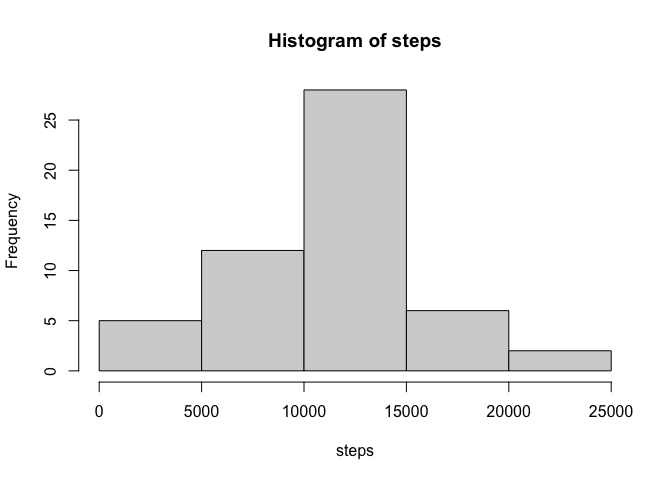
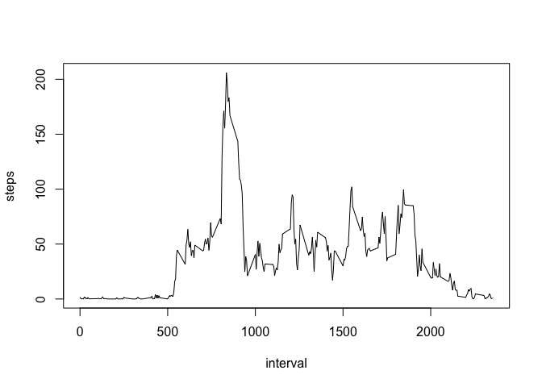
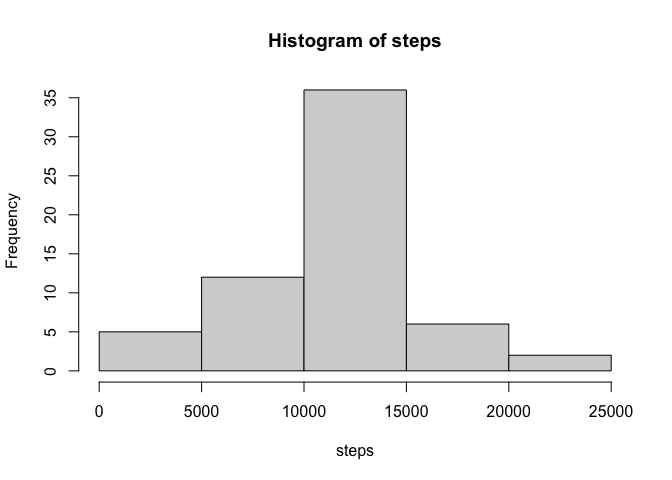
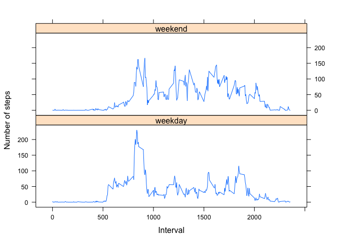

## Loading and preprocessing the data

```r
unzip("./activity.zip")
Data <- read.csv("./activity.csv")
summary(Data)
```

```
##      steps            date              interval     
##  Min.   :  0.00   Length:17568       Min.   :   0.0  
##  1st Qu.:  0.00   Class :character   1st Qu.: 588.8  
##  Median :  0.00   Mode  :character   Median :1177.5  
##  Mean   : 37.38                      Mean   :1177.5  
##  3rd Qu.: 12.00                      3rd Qu.:1766.2  
##  Max.   :806.00                      Max.   :2355.0  
##  NA's   :2304
```

```r
str(Data)
```

```
## 'data.frame':	17568 obs. of  3 variables:
##  $ steps   : int  NA NA NA NA NA NA NA NA NA NA ...
##  $ date    : chr  "2012-10-01" "2012-10-01" "2012-10-01" "2012-10-01" ...
##  $ interval: int  0 5 10 15 20 25 30 35 40 45 ...
```

```r
names(Data)
```

```
## [1] "steps"    "date"     "interval"
```

```r
head(Data)
```

```
##   steps       date interval
## 1    NA 2012-10-01        0
## 2    NA 2012-10-01        5
## 3    NA 2012-10-01       10
## 4    NA 2012-10-01       15
## 5    NA 2012-10-01       20
## 6    NA 2012-10-01       25
```


## What is mean total number of steps taken per day?

```r
StepsPerDay <- aggregate(steps ~ date, Data, sum, na.rm=TRUE)
with(StepsPerDay, hist(steps))
```

<!-- -->

```r
meanStepsPerDay <- mean(StepsPerDay$steps)
medianStepsPerDay <- median(StepsPerDay$steps)
meanStepsPerDay
```

```
## [1] 10766.19
```

```r
medianStepsPerDay
```

```
## [1] 10765
```
The mean number of steps per day is 1.0766189\times 10^{4}.
The median number of steps per day is 10765.

## What is the average daily activity pattern?

```r
StepsPerInterval <- aggregate(steps~interval, data=Data, mean, na.rm=TRUE)
plot(steps~interval, data=StepsPerInterval, type="l")
```

<!-- -->

```r
intervalMaxSteps <- StepsPerInterval[which.max(StepsPerInterval$steps),]$interval
intervalMaxSteps
```

```
## [1] 835
```
The 5-minute interval containing the maximum number of steps is interval 835.

## Imputing missing values


```r
DataMissing <- sum(is.na(Data$steps))
DataMissing
```

```
## [1] 2304
```
The total number of missing values in the data set is 2304.

Let's use a simple strategy to fill in the missing data, namely using the mean value for that interval. We create a new dataset called DataFilledIn with the NA values replaced by the appropriate mean value. We create a function getMeanSteps that returns the mean value for a particular interval.

```r
getMeanSteps <- function(interval){
     StepsPerInterval[StepsPerInterval$interval==interval,]$steps
}
DataFilledIn <- Data
for(i in 1:nrow(DataFilledIn)) {
    if(is.na(DataFilledIn[i,]$steps)) {
        DataFilledIn[i,]$steps <- getMeanSteps(DataFilledIn[i,]$interval)
    }
}
```

## Are there differences in activity patterns between weekdays and weekends?


```r
StepsPerDay2 <- aggregate(steps ~ date, DataFilledIn, sum, na.rm=TRUE)
with(StepsPerDay2, hist(steps))
```

<!-- -->

```r
meanStepsPerDay2 <- mean(StepsPerDay2$steps)
medianStepsPerDay2 <- median(StepsPerDay2$steps)
meanStepsPerDay2
```

```
## [1] 10766.19
```

```r
medianStepsPerDay2
```

```
## [1] 10766.19
```

The mean number of steps per day is now 1.0766189\times 10^{4}.
The median number of steps per day is now 1.0766189\times 10^{4}.

Change in mean = 0.
Change in median = -1.1886792.

The impact of imputing missing data is to make the median equal to the mean. There is no change in the mean, since we have been adding an average of the existing data. 
Create a new factor variable in the dataset with two levels -- 'weekday' and 'weekend' according to the day of the week.
Make a panel plot comparing the two average steps per interval of each.


```r
DataFilledIn$date <- as.Date(strptime(DataFilledIn$date, format="%Y-%m-%d"))
DataFilledIn$day <- weekdays(DataFilledIn$date)
for (i in 1:nrow(DataFilledIn)) {
    if (DataFilledIn[i,]$day %in% c("Saturday","Sunday")) {
        DataFilledIn[i,]$day<-"weekend"
    }
    else{
        DataFilledIn[i,]$day<-"weekday"
    }
}
stepsByDay <- aggregate(DataFilledIn$steps ~ DataFilledIn$interval + DataFilledIn$day, DataFilledIn, mean)

names(stepsByDay) <- c("interval", "day", "steps")
library(lattice)
xyplot(steps ~ interval | day, stepsByDay, type = "l", layout = c(1, 2), 
    xlab = "Interval", ylab = "Number of steps")
```

<!-- -->
